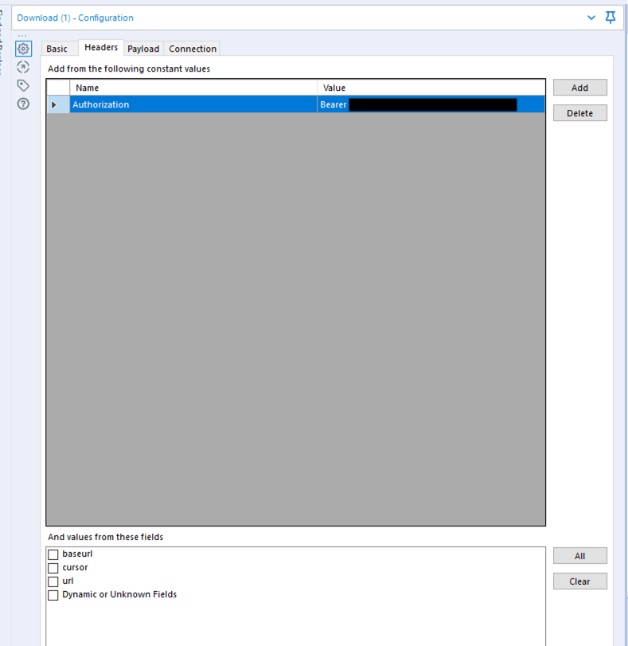

# Bubble

Connecting to Bubble.io is a fairly straightfoward API with an API auth token. 

## Macro

[Download the macro here](https://drive.google.com/file/d/1Ijxi-7AWHx8nA4VZ1YhcuwyX_0w3xe3X/view?usp=sharing)

Bubble.io's api maxes out at 100 rows, meaning we need an interative macro to ensure we are looping through all of the records. 

The only thing you should need to change to use the macro is the bearer authentication in the download tool. 

## Using the macro

To use the macro you need to have a text input tool with the column cursor and the value 1. This means the macro will start at the 1st record of the table you are calling.

Lastly, all you need to do is enter the table name you are trying to export and thats all! 

