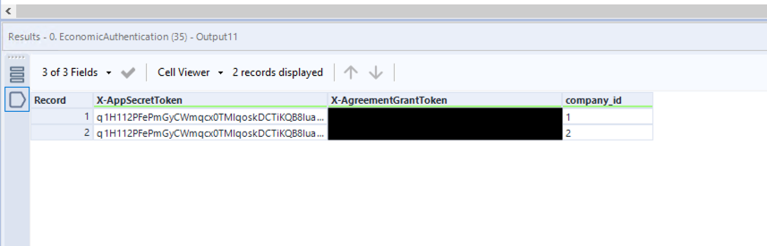

# Economic 

[Download the macros here](https://drive.google.com/file/d/11IkdDuHMxXTF8eTx9Nl3bDujFhNAW7r6/view?usp=sharing)

[Economic API Documentation](https://restdocs.e-conomic.com/#introduction)

When connecting to economic there are a few things to remember, although the process is quite straightfoward. 

## Authentication

The first thing you will need to do is create an app PER COMPANY in economic in order to get the access tokens. They should look something like this and should be put into the authentication input in the macros.

## Standard Macro

Next up, there are 2 possible macros for you to use, one that is paginated, and one that is not. 

The standard (non-paginated) macro should be used when you call APIs that do not have "lastPage" as an output. This is tables like companies, customers, etc. If it does not have lastPage, then it is not a paginated table and can use the standard macro. 

To use the macro, simply feed it a url. The url for companies looks like this: https://restapi.e-conomic.com/self

## Paginated Macro

The paginated macro can be used for those really large tables like invoices. To use the macro, give it a url like this: url
https://restapi.e-conomic.com/invoices/booked?filter=date$gt:2021-02-02&pageSize=1000

In this case we are getting invoices from Feb 2, 2021 and later.

## Getting Economic Entries

Lastly, it is a bit trickier to get economic entries, which will most likely be one of your main tables. Here we do not use a macro, but the flow is attached. Essentially what you have to do is download a list of all of the financial years for each company. Then you call the api one company/year at a time. PLUS do pagination on top of that. fun fun :)

