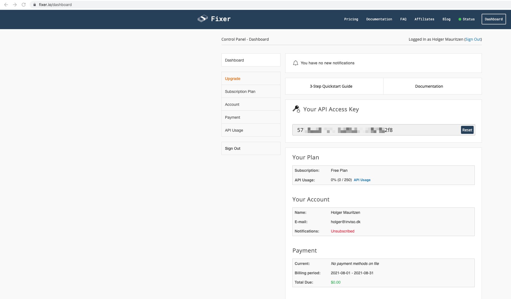

# Fixer.io

Fixer.io provides an exchange rate API. 

The service has different plans, with the free one containing 250 API Calls/mo based on hourly updates. It should be noted that the free plan dosen't contain all base currencies anymore. You therefore cannot base the call in DKK without buying a paid plan. 
[More info](https://fixer.io/product)

[The macro package](https://drive.google.com/file/d/1Du82EBmlkJyEZafnElSXwrP74oO0Rtso/view?usp=sharing) contains two workflows:

1. FixerRates.yxmd
    * This workflow is an example of how you can build an API call to load from a database, check which rates are missing from the desired time period and then call for only the necesarry information. 
    
2. FixerRatesActual.yxmd
    * Is a simpler workflow that shows how the API call can be built
    

### Getting an API Token

To get started you need an API token. This can be generated by signing up at fixer.io and can then be found on the dashboard front page. 
    

### Using the API 
Once you have your API token, you can build the API calls. 
The easiest way to do this, is to base your call on the provided macros, updated with your own API key. 
To help you further, Fixer.io has quite [extensive documentation](https://fixer.io/documentation). 

An example of how a call can be built to provide all the latest exchange rates based on Euros:

http://data.fixer.io/api/latest?access_key=55jdklskjlw3434tssfd2f8&base=EUR&symbols=

