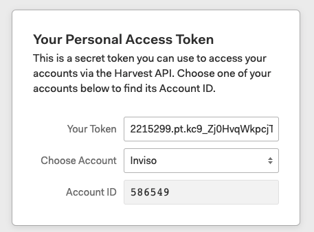

# Forecast
Forecast data can be extracted through the Harvest API. 

This can be done using either OAuth2 or Personal Access Tokens.

For internal use Charlotte already has set up workflows that extract and parse Forecast data, which should cover any data cravings you might have. 
These are built on a Personal Access Token for the Inviso user. These give access to all our forecast data and the API keys should therefore be treated with care.  

### Workflows
The workflows can be [downloaded here](https://drive.google.com/file/d/1osD5_4PJNNA4RUbtZMAN2303PeCA3-9w/view?usp=sharing). 

The Authentication is located in the macro "0.ForecastAuthentication.yxmc". This needs to be opened and closed prior to opening the other flows. 
This should make it work, however if it dosen't you may have to save it in your Macros folder and add it to the workflows again.

### Further documentation
While the abovementioned workflows and macro should cover most uses, here follows a brief overview of the API. 

#### The API call
In order to access the API you need 3 things: 
1. The URL: https://api.forecastapp.com
2. Your Account ID: https://forecastapp.com/YOUR-ACCOUNT-ID-IS-HERE/projects
3. A Personal [Access Token](https://help.getharvest.com/api-v2/authentication-api/authentication/authentication/): As mentioned we already have one set up for internal use. If you for some reason need to create a new one, then it can be done [here]( https://id.getharvest.com/developers).
    * To get a Personal Access Token simply click "Create New Personal Access Token". Enter your name and you will then be lead to the page shown below where you can get your Bearer token and Account ID. 
    

The authentication consists of a Bearer token, The Forecast account ID And the User-Agent. The internal access token is contained in the macro 0.ForecastAuthentication.yxmc.

#### Calling the API
Once you have your Access Token, it should be straightforward to call the API. 
Enter the URL you wish to extract data from (E.g. https://api.forecastapp.com/projects for projects), and use the download tool with the authentication to extract the data. The data is then extracted in JSON format, ready to be further parsed.
