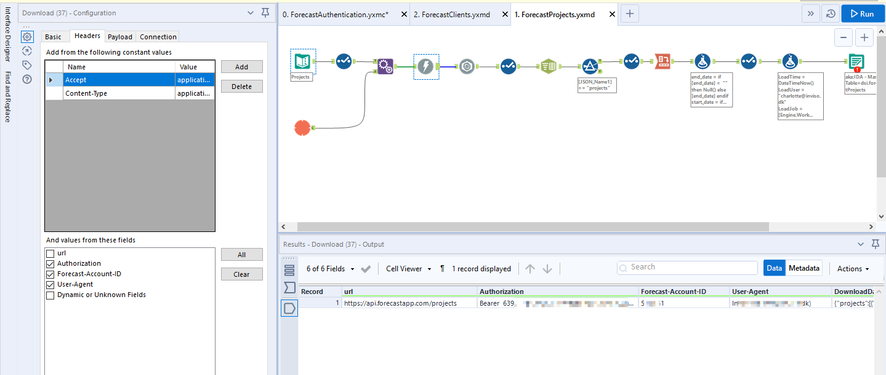

# Harvest

### Macros
Thankfully Charlotte already has set up macros that extract and parse Forecast data, which should cover any data cravings you might have. The macros can be [downloaded here](https://drive.google.com/file/d/1osD5_4PJNNA4RUbtZMAN2303PeCA3-9w/view?usp=sharing). 

### Further documentation
While the abovementioned macros should cover most uses, here follows a brief overview of the API. 

#### Setting up the API client
In order to access the API you need 3 things: 
1. The URL: https://api.forecastapp.com
2. Your Account ID: https://forecastapp.com/YOUR-ACCOUNT-ID-IS-HERE/projects
3. An [Access Token](https://help.getharvest.com/api-v2/authentication-api/authentication/authentication/): As mentioned we already have one set up for internal use. If you for some reason need to create a new one, then it can be done [here]( https://id.getharvest.com/developers).

The Access Token consists of a Bearer authentication, The Forecast account ID And the User-Agent. The internal access token is contained in the macro 0.ForecastAuthentication.yxmc:

#### Calling the API
Once you have your Access Token, it should be straightforward to call the API. 
Enter the URL you wish to extract data from (E.g. https://api.forecastapp.com/projects for projects), and use the download tool with the access token to extract the data. The data is then extracted in JSON format, ready to be further parsed.
