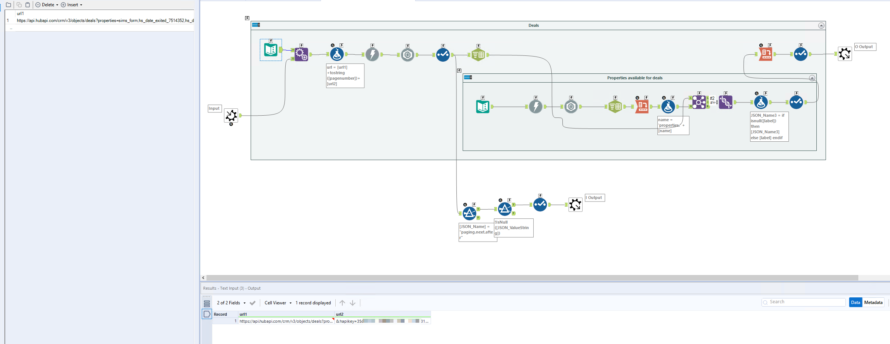

# HubSpot
HubSpot's API support both [OAuth and API keys](https://developers.hubspot.com/docs/api/developer-guides-resources). 

This guide will only cover using the HubSpot API with API keys. 
A guide for setting up OAuth with HubSpot can be found here [here](https://developers.hubspot.com/docs/api/working-with-oauth)
The API is paginated why an iterative macro is necesary. 

The provided Macro package contains:
1. HubSpotDealsMacro.yxmc
    * An iterative macro to show how an API call for HubSpot is built.
2. HubSpotCompaniesMacro.yxmc 
    * Alternative iterative macro

The macros can be [downloaded here](https://drive.google.com/file/d/1vgabb6RhAILU1K8Z78k79tSvPjbkbfxn/view?usp=sharing)

The reference documentation for the HubSpot can be found [here](https://developers.hubspot.com/docs/api/overview)

### Setting up the API key

#### Generating the API key
Each HubSpot key is specific to an account, and each account can only have one key at a time. 
In order to access the API key for an account, you need to have Super Admin permissions. 

To access the API key:

1. In your HubSpot account, click the settings icon settings in the main navigation bar.
2. In the left sidebar menu, navigate to Integrations > API key.
    * If a key has never been generated for your account, click Generate API key.
    * If you've already generated an API key, click Show to display your key.
    show-API-key
    
3. With the key displayed, click Copy to copy the key. You can then paste the key to provide it to your developers or use it in your applications.

As this API key provides access to all data and ability to make changes in HubSpot it is recommended to rotate it often and only allow trusted developers to access it. 

More information can be found [here](https://knowledge.hubspot.com/integrations/how-do-i-get-my-hubspot-api-key)

### Using the API key with Alteryx

All HubSpot APIs are built using REST conventions, and thereby have a predictiable URL structure made under https://api.hubapi.com and all responses return standard JSON.

The key should be added at the end of each call in the format of &hapikey=API_KEY 
For example: "&hapikey=67kb56le-624e-6v23-75s3-alf4f246573e"

In the provided macro HubSpotDealsMacro.yxmc the API key is included as url2 in the text input. This input should be updated accordingly with the generated key. 

