# Microsoft Dynamics
### Alteryx to Microsoft Dynamics CRM
Connecting Alteryx to Dynamics requires quite a bit of initial setup, which is described in detail in the next section. 
After this initial setup there are then 2 ways to connect to Dynamics as you can either:
1. Create your own macro / utilize the Inviso made macros provided in the download link 
2. Use the Microsoft Dynamics tools from the gallery. 

Beware that the tools from the gallery cause Alteryx to run quite slow, whereby it will often be preferable to create your own macro.

In either option you will need to know which entity (table in Dynamics) you want to download.

Download the Inviso Alteryx Macros [here](https://drive.google.com/file/d/1yMkMkaS9Qzb58Ltz4s6gIpcn91PA1PAq/view?usp=sharing)

## Initial setup 
The initial setup should be done by the IT Admin.

NOTE: Some entries in this guide have been covered / removed to protect and anonymise the client. These are either blurred or changed to either COMPANYNAME or HIDDEN.

### Azure AD App 

The first thing you need to do is to create an Azure AD app. To do that, go to Azure AD, and click on App Registrations (not Enterprise applications). 

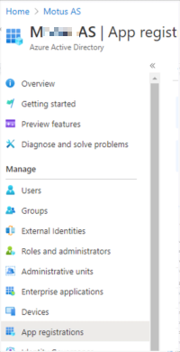

Click create a new app and give it a name, click create. You should be taken to the home page which looks like the below. In the next steps, you will need the Application (client) ID and the Directory (tenent) ID that are stated in the overview at the top. 
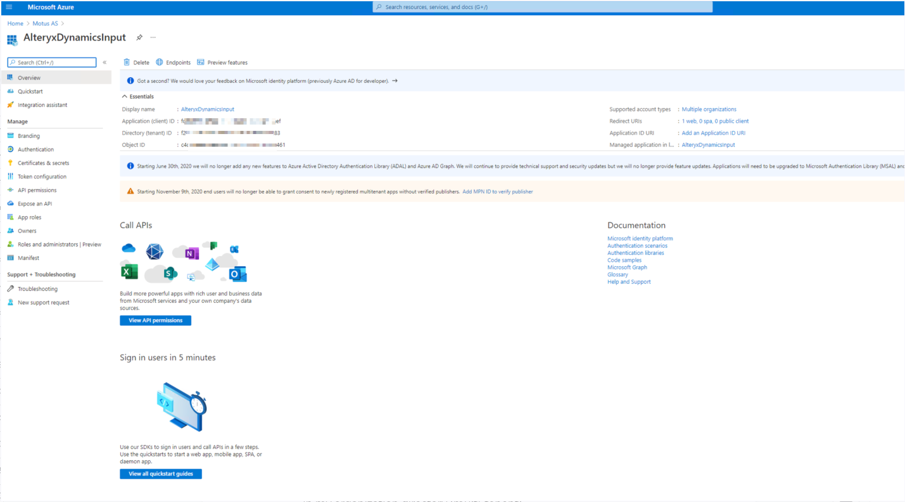

Now we need to adjust some settings.
Go to authentication. Click add a platform, select web. You will need to add a redirect url, use: https://login.live.com/oauth20_desktop.srf which is the standard Microsoft AD login
Still under authentication, under supported account types, click Accounts in my organization directory (multi-tenent)
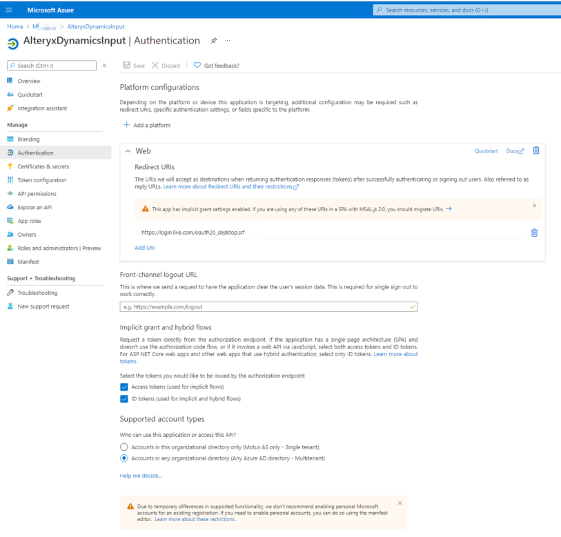

Next go to the Certificates and secrets section. You will need to create a new client secret. WRITE DOWN THE VALUE, you will not be able to see it again.
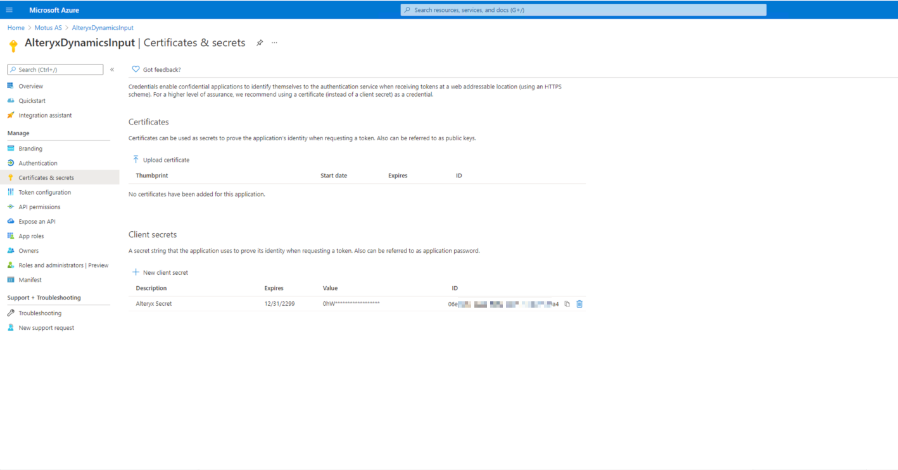

Next go to API permissions. Add a permission for Dynamics CRM with the user_impersonation permission.
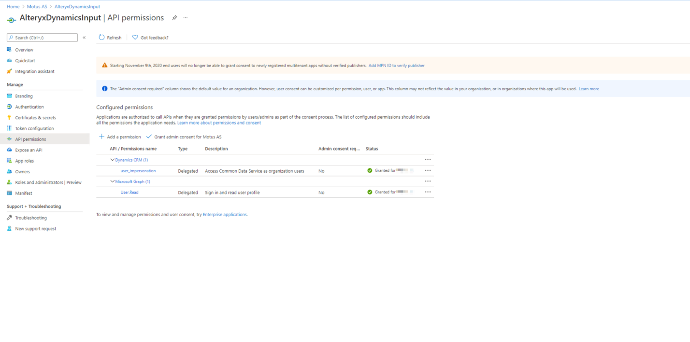

Go to the owner section. If necessary, add another owner to your app. Those with access to all apps will be able to see your app, so in this area you just will add additional people who will need access.
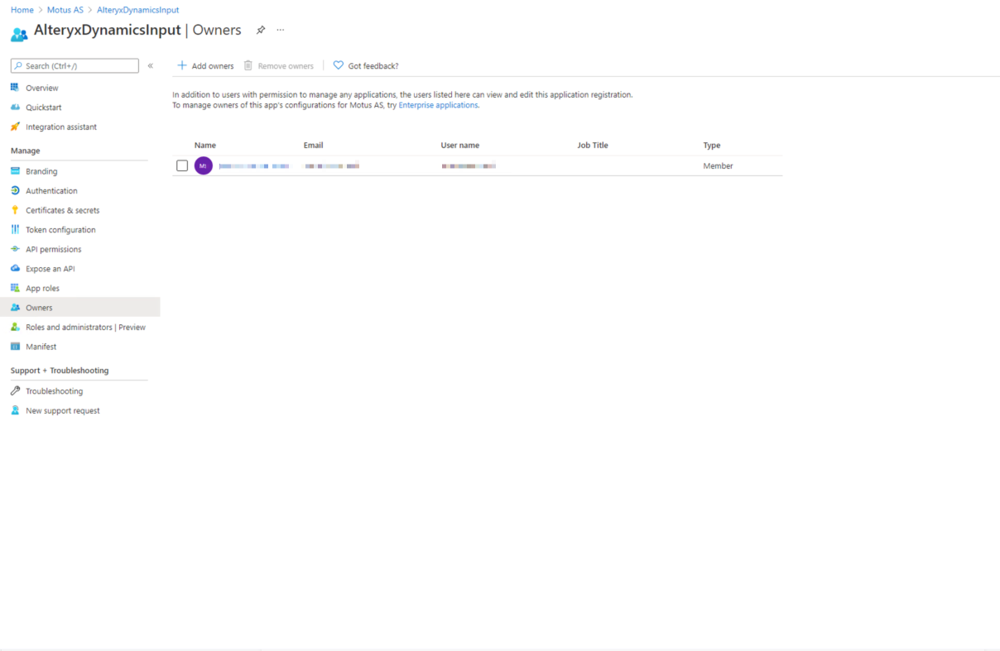

Now, a very important step! Go to Manifest, find the line that says oauth2AllowIdTokenIDImplicitflow and change false to true. Also change the line oauth2AllowImplicitflow the same way.
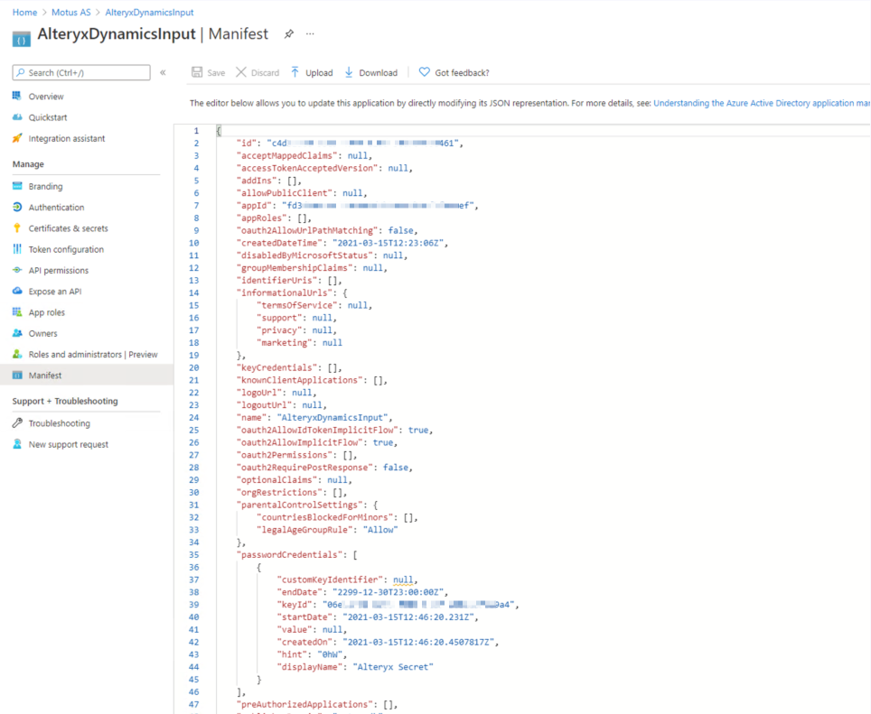

Now your app is ready for use. From here you can either continue to follow the steps for creating your own Alteryx macro, or install the general tool to pull out one table at a time

### Using the API in Postman with OAUTH2
Create an environment: 
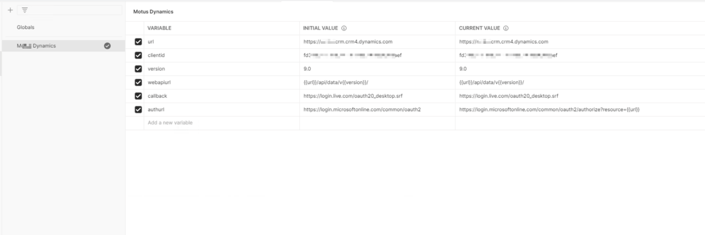

Set up OAuth2 to get your token:
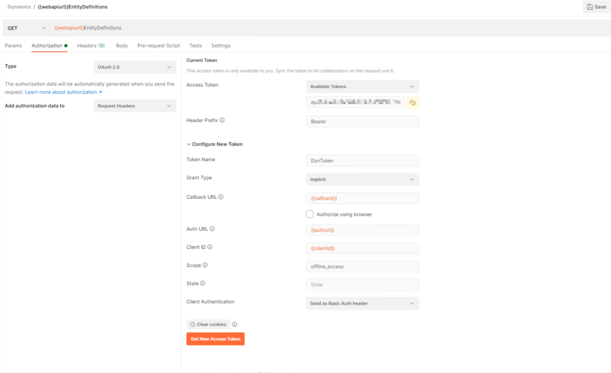

Use the access token to test. Here I am using the “EntitityDefinitions” call to test, which gives you a list of all of the tables or “entities” as they are called in Dynamics CRM. No body or headers are needed. 

##### Using the API in Alteryx
To use the API in Alteryx, we will need to use postman to get an initial access and refresh token. Once we have the refresh token, we can create an Alteryx macro to log in and call the API.

To get the initial token, you first need to get a “code” which is one of the required headers in Postman. This is the weirdest part. 

Using the following link, fill out your relevant information in the link:
The information can be found on your Azure page.

login.microsoftonline.com/common/oauth2/authorize?resource=THE_SITE_YOU_WANT_TO_ACCESS_BY_API&client_id=YOUR_CLIENT_ID&response_type=code&redirect_uri=YOUR_CALLBACK_URL

Ours looked like:
login.microsoftonline.com/common/oauth2/authorize%3Fresource=https://COMPANYNAMEcrm.crm4.dynamics.com&client_id=fdHIDDENef&response_type=code&redirect_uri=https://login.live.com/oauth20_desktop.srf

Note: You might need to do this on a windows computer, it did not work on a mac

This will probably return a page that cannot be reached - but don’t worry! Look at the URL address line - it should now be something like this:

//callbackurl/?code=AIADCEemlorJHF0R7FNsb_LXwNe4DF3kEMnDAeRJFf4h52FkfsJK223vPNfjU8fBDoub1l_glaFKEmET34SV5aFHaBJ-kRiAE34FaeFGgAA&session_state=15634a4g6-0k8f-4632-b756-g757e3e9ekd2

What you need from this is code after ?code= and before &session_state= (it will probably be much longer!)

Now back to Postman
Fill out a call like this. (note it is post, and is encoding. There are no headers)
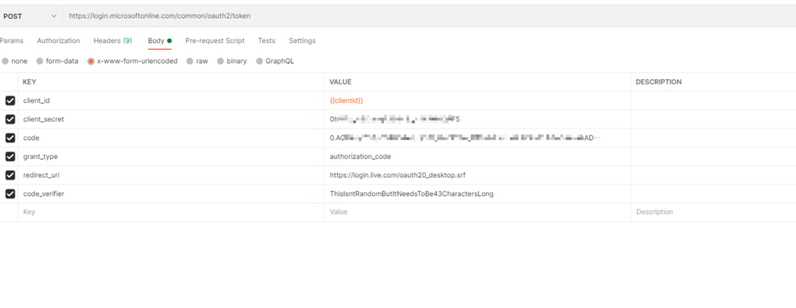

NOW, out of the response from this, we will only use the refresh_token, and now it is finally time to head to Alteryx. 

###### Alteryx Macro Setup
If you haven't yet downloaded the Alteryx macros the link can be found at the top. 

What we will do is create a macro that fetches us an access code by using the refresh code. Every time we get a new access code, we also get a new refresh code, which we will then use until the next time we get a new access code. First we create a file with our necessary fields. Then we call the API. Then we take the new refresh token and replace the old one in the file. This becomes our input for next time. 

Overall authentication flow: 
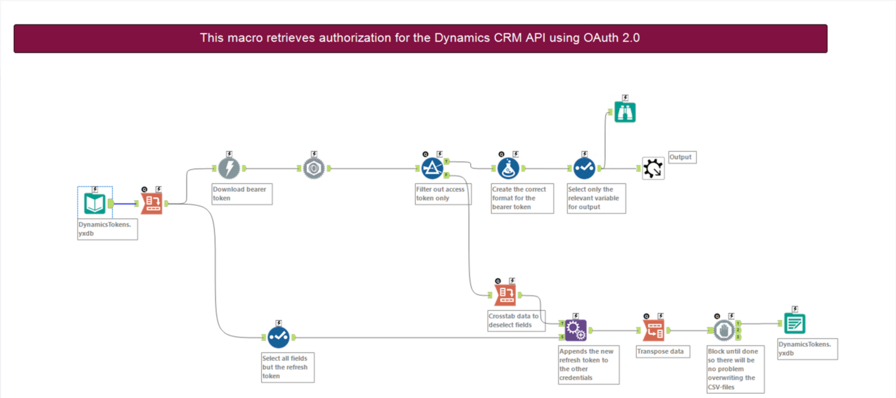

Contents of the input file:
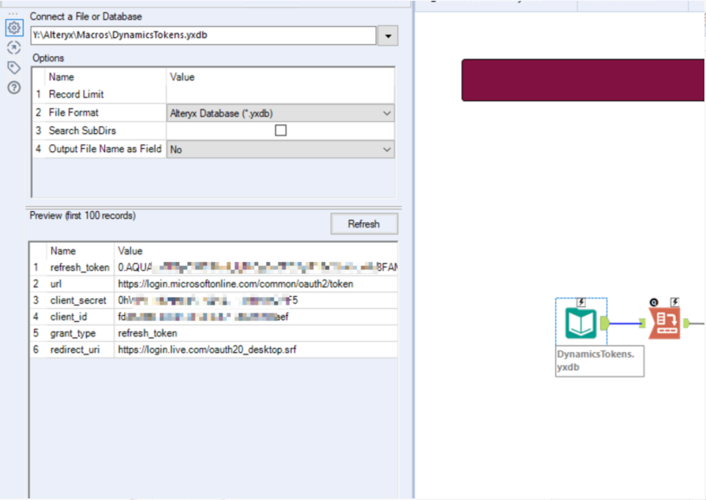

Download tool settings:

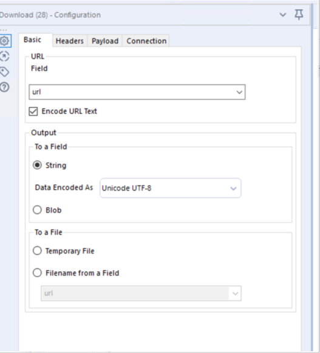
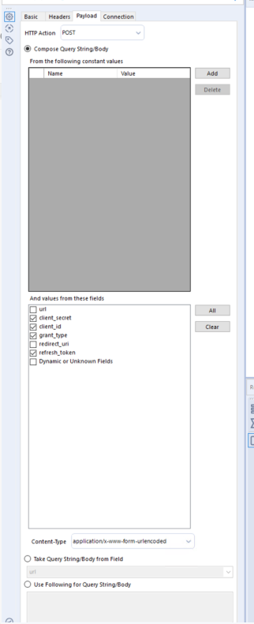

Now we have a macro to authenticate for us in Alteryx. Below we use our authentication macro to get the access code it is output by the macro in a column named “Authorization”. We append that code to the URL we are going to call, in this case we are going to download the EntityDefinitions like we did before.
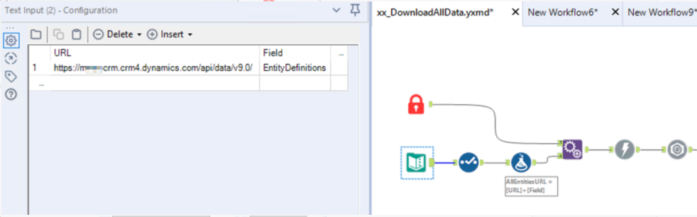

The download tool setup:

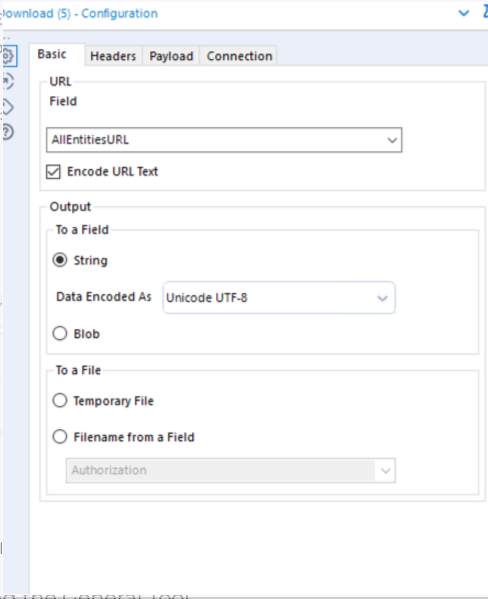
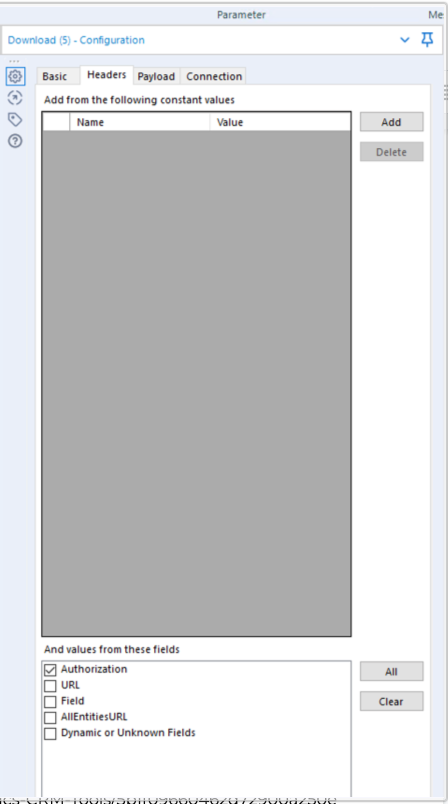
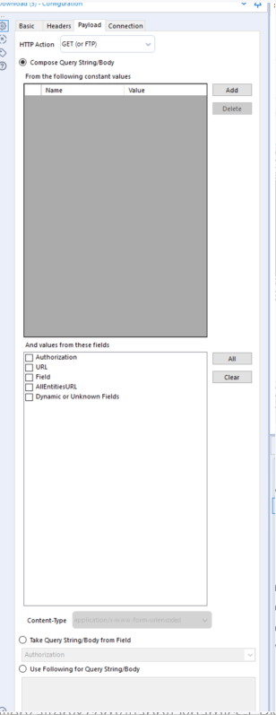

And FINALLY, we have data from Dynamics CRM :) 

### Creating your own macro / Using the provided macros

The macros folder at the top contain 3 macros.
The first DynamicsGetBearerToken as the name suggests is used to get a refresh token for each time you call Dynamics. This will have to be set up as described above. Once this is done the two other macros can be used:

1. DynamicstoFlow::
This one takes an entity you want to download and outputs it to your workflow

2. DynamicstoSnowflake:
This one takes a list of entities you want to downloads, and outputs them each individually to a RAW table on snowflake. 
The Snowflake credentials for the desired output will need to be intered here. 

Note: This macro maxes out at 5000 records returned from the API. As of writing there has not been a case where more were needed. If more records are present, a workaround needs to be created. 

### Alternative: The Alteryx Gallery Dynamics tool. 
The Alteryx Gallery also has a dynamics tool which also requires you to set up the app. However this tool has the drawback of being quite heavy and thereby making Alteryx run super slow, but it can be usefull if you only need one or few entities. To set this up [download the macro from the gallery](https://gallery.alteryx.com/#!app/Dynamics-CRM-Tools/5b1f09660462d72900a250e6) and do the following:
1. Download the yxi file from the gallery.
2. Rename the extension from .YXI to .ZIP
3. Extract the zip file
4. Locate requirements.txt file within Input/Output Tool folders.
5. Open and edit requirments.txt file to add cryptography==2.9.2 as the last line for both Input and Output folders.
6. Save/update file.
7. Rename the extension from .ZIP to .YXI
8. Run the installer

After installing the macro in Alteryx the input and output macros for dynamics will be under connectors in your toolbar

