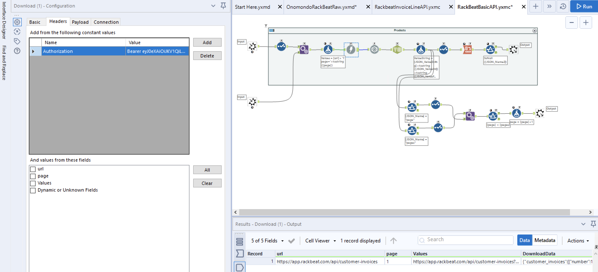
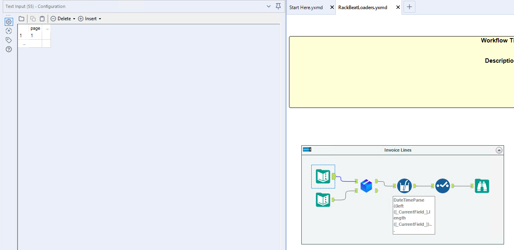
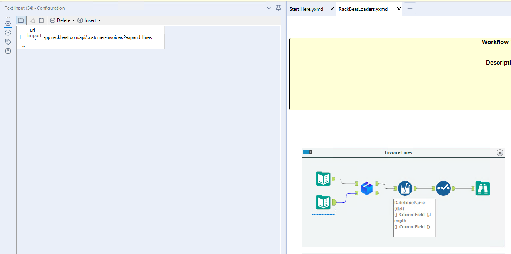
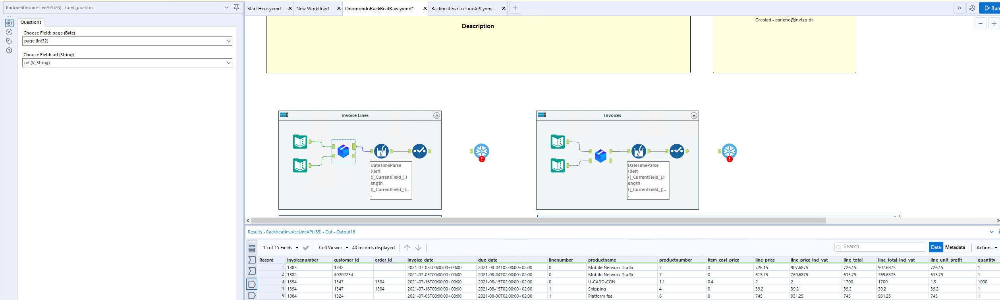

# Rackbeat

Connecting to the Rackbeat API is quite straigtforward. 
The authentication can be done using either a personal bearer token or OAuth v2. 

The approach described here is done using a personal token. It simply requires generating an authorization token on the Rackbeat site and inserting it into the download tool of the provided macros. 

The macro package can be [downloaded here](https://drive.google.com/file/d/1pvzPZZcsKARS1n4qycnQjoTKCDtY1Bqw/view?usp=sharing)

The package contains:
1. RackBeatBasicAPI.yxmc 
    * This macro is a basic iterative macro for the Rackbeat API.
2. RackbeatInvoiceLineAPI.yxmc 
    * Similar to the basic API, this macro is used to get the invoices from the Rackbeat API
3. RackBeatLoaders.yxmd
    * Large flow that has examples of how to use the macros and extract different types of data

The API is paginated, why an iterative macro is needed to extract all the data. 
&nbsp  

The official Rackbeat API documentation can be found [here](https://rackbeat.docs.apiary.io/#)

### API Setup
As mentioned above, this API setup is done using Personal tokens. Using OAuth requires a more extensive setup, similar to the one described for Microsoft Dynamics (CHECK WITH CARLENE)

#### Token Generation
The authorization for the Rackbeat API requires you to generate a bearer token. 
This is done by:
1. Login to Rackbeat, go to the settings and find the API menu.
2. Create a new API token. 

You should now have the required API token, which needs to be inserted in the download tool of the macro. 

#### Macro Setup
Once you have your Bearer token you simply need to change the authorization in download tool in either the RackBeatBasicAPI.yxmc or RackbeatInvoiceLineAPI.yxmc. 

To do this:

1. Open one of the macros
2. Click on the download tool and then go to headers
3. Insert your API token into the Value of the Authorization line to be "Bearer API_Token". It should look something like this:

 Bearer eyJ0eXAiOiJKV1QFa35GSDE1NiJ9eyJhdAey54edSFESnRpIjoiODESDFo54e-3Y2E55OTU3ZTg4NTMxDIJew435dEFEF436jiEWFGHXC43-6esf23ASDFq1-TY4zMGU3ASES344YWIwZTgzYzQyZGYiLCJpYXQiOiIxNjE3NjkwMzgyLjgwODAoijiOfjirgEIJFOSJIOFeijfgij4564iMTkzMzIyMzE4Mi43MzIzNTkyIiwic2NvcGVzIjpbXX0D38_NT2ZuSoidrgi4KDKJSJLD-TAKdkfjklg3423523-adoawijdjio43545eQrjzJMbrG-ASDE234nkYl-97tfQa9gFAyHIOFnewDGpGyBQmXq-wzWVOcwSi-dsfgr326prU_W_YgYyGGo3iP8L-3o8lPGSAJji564234sfAdZHRHerFvXMLr9QclcfMo71YjID93t1-wfPlxprwMSymAOIgji342jkymZP7X8raEqkb2vDSYlPZvbZ7qhsjWHTJ-TSEVccAFIO3n-c9FAjawsOAQ
4. Save the macro and make sure that your workflow refers to the updated macro

It should look like this:

### Using the Macros 
The macros have two inputs and outputs. 

Top input:
    This should simply be a single column and row with the header "page" and number 1. This is used for the iteration part of the macro to know where to start and update for each iteration.
    

Bottom input: 
    The bottom input should be the URL for the api such as "https://app.rackbeat.com/api/products". An extended list of the possible references to call can be found in the [official documentation under "Reference"](https://rackbeat.docs.apiary.io/)
    

Top output: 
    Contains the downloaded and parsed data from the API call to be used. 
    

Bottom output:
    This is used for the iteration and should be left unconnected. 

