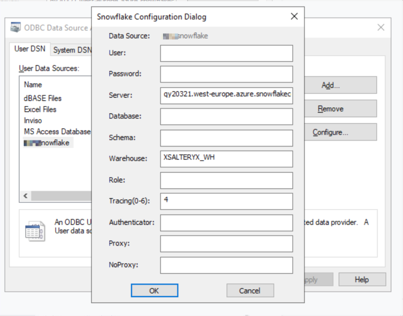
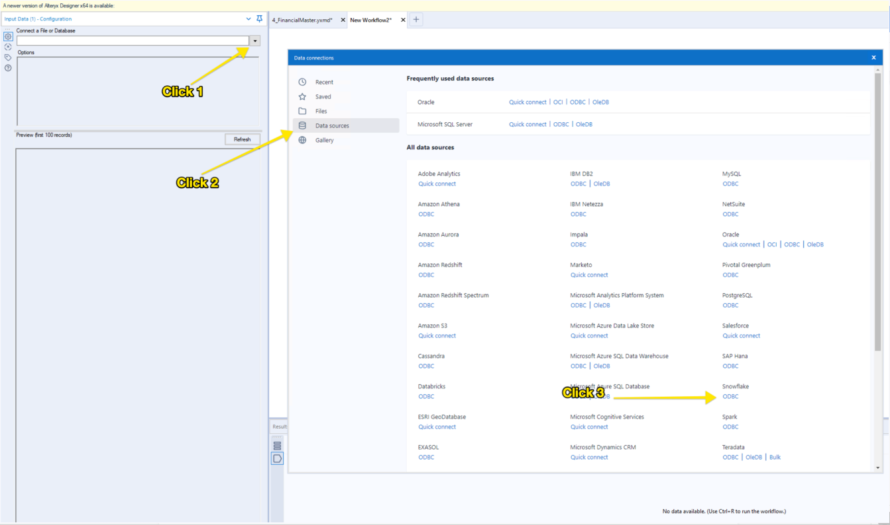
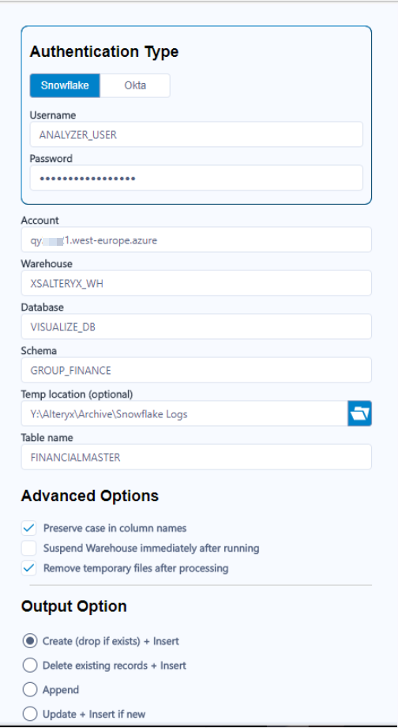
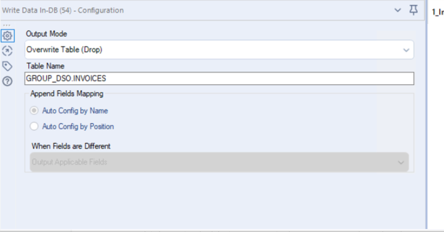

# Snowflake

Snowflake integration with Alteryx is quite straightforward, as well as being constantly improved. 
The documentation below was written for a customer, whereby especially the names of users and databases will be different. 

### Input - Input Tool

1. Complete steps 2 & 3 only the first time you use the input tool

2. Download ODBC driver: (win64 version) https://sfc-repo.azure.snowflakecomputing.com/odbc/index.html

3. Create new ODBC connector

    a. Click the windows button in the lower right corner of your computer

    b. search for ODBC Data Sources (64 bit) and open 

    c. Click on the drivers tab, ensure you have one for snowflake

    d. Click on User DSN

    e. Click add

    f. Select the snowflake driver

    g. Complete configuration as below. The server should be qy20431.west-europe.azure.snowflakecomputing.com. Ensure the data source is called COMPANYNAMEsnowflake. All of these fields are case sensitive!

4. Now for the Alteryx part, open Alteryx and drag an input tool onto your canvas.

5. Click to open Snowflake ODBC Connection

6. Select COMPANYNAMEsnowflake and enter a username and password

7. Select a table to read in just as you usually would! 

### Input - In-DB Tools
1. Drag the connect in-db tool to your canvas
2. In configuration, select the arrow under the connection name
3. Click open file connection
4. Choose the connection file Y:\Alteryx\InDB Connection Files\snowflakeconnection
5. After applying the transformation you would like to do to your data, use data stream out to “load” the data into your Alteryx before using the snowflake output tool

**Note you can also use the in-db tools completely to create new tables in the same database that you have read from. 

### Output - Snowflake Output Tool

1. Complete steps 2-6 the first time only for set up
2. Go to this folder: Y:\Alteryx\SnowflakeMacros\SnowflakeOutput
3. Click on snowflake.yxi, Alteryx will open and click run
4. It will take a few minutes to install
5. Close and re-open Alteryx
6. Now you will have a new Snowflake tool in your toolbar under connectors

7. Drag this new snowflake tool to your canvas as you normally would an output tool
8. Configure as below, remember to use the correct user and database.
9. Use the FINANCE_DB database
10. Use the correct schema for your data. See snowflake overall architecture for guidelines
11. Use the DEVELOPER_USER access.

Note - if you are just updating the tool, follow these steps: 
Go to %appdata%/Alteryx/Tools/
Delete the folder called Snowflake with all contents (you can leave the one called Snowflake_venv)
Reinstall the yxi file

If you are creating a flow that will just be run alone manually, also enable Suspend Warehouse Immediately after Running

### Output - In-DB
Simply set the write data in-db tool to output. You will need to add the schema name + . + table name.

You will need to run the flow 2 times, the first time set output mode to create table. From then on you can use overwrite table.

