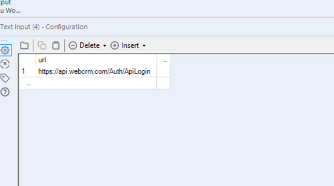
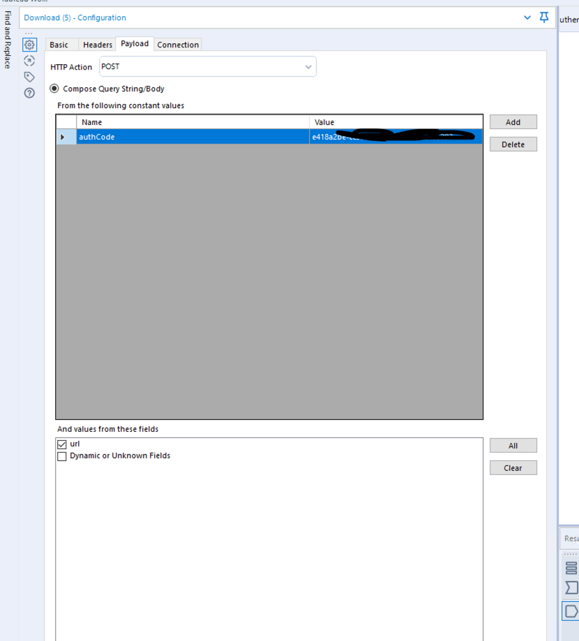
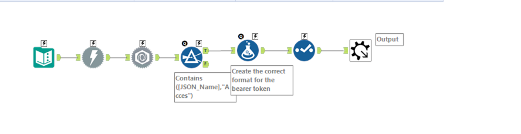
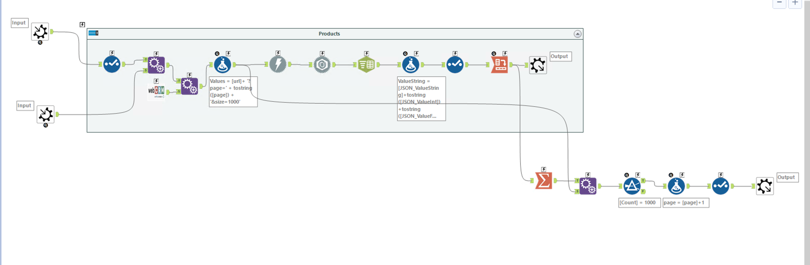
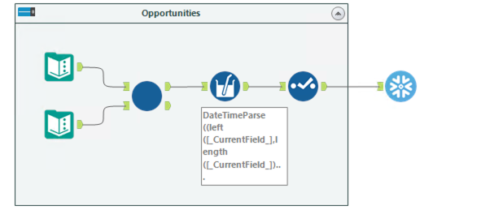
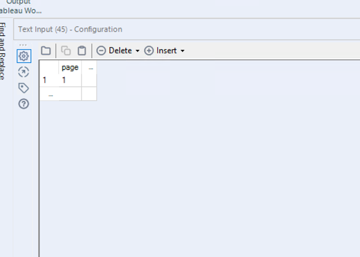
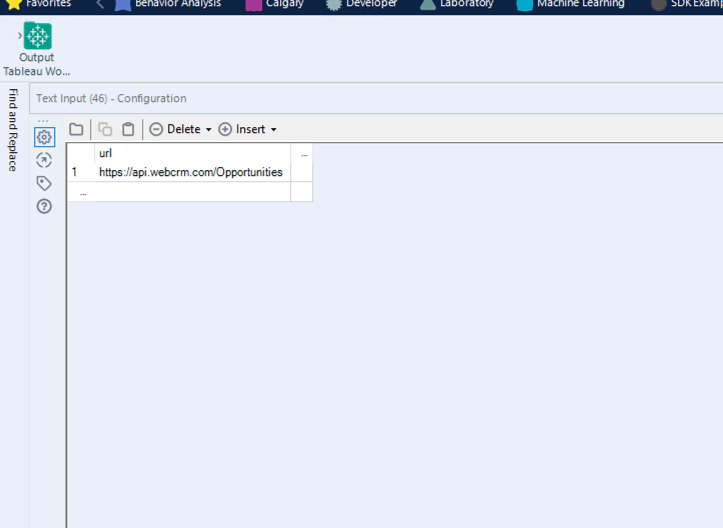

# WebCRM

[Download the macros here](https://drive.google.com/file/d/1kXjYEkSVYIUy8EzpfhTkHx5YHu5yKru2/view?usp=sharing)

The WebCRM API is very straightfoward. First you need to use a API key to get an access token. Then you can call the API which is paginated. 

## Get access token 

Use the authenication macro. 

It requires a url as an input, and a token in the download tool. 

## Use the API to get data

Then you simply add the authentication macro into the API marco, it is already set up with pagination. You need to feed it a url, and a text input tool with the column page and the value 1

